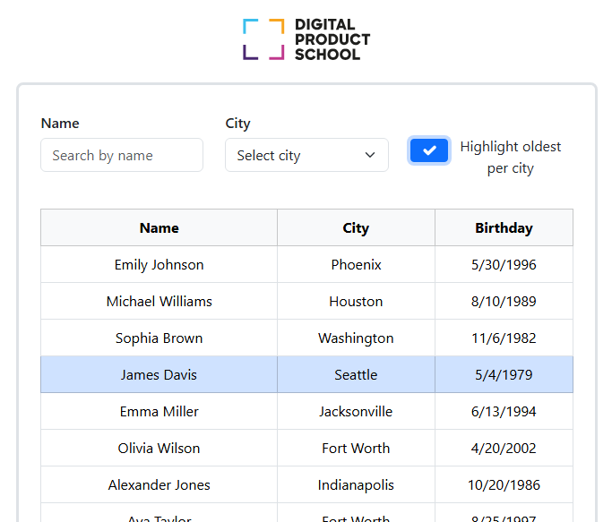

# DPS Frontend Coding Challenge

## Overview
This project is a solution to the **DPS Frontend Coding Challenge**, which involves enhancing a CRM (Customer Relationship Management) software by developing a feature to display and filter customer data effectively. The application is built using **TypeScript** and **React**.


## Features
### Implemented Features:
1. **Searchable Customer List**  
   - Dynamically filters customers by `firstName` or `lastName` using a **Name Filter** input field.
   
2. **City Filter**  
   - A dropdown to filter customers by city based on the available data.

3. **Highlight Oldest Users**  
   - A checkbox to highlight the oldest user in each city.

4. **Debounced Search**  
   - Added a 1-second debounce to the Name Filter input for improved performance.

5. **Responsive Design**  
   - UI designed to match the provided mockup and is optimized for various screen sizes.


## Environment Setup
Ensure you have the following installed on your system:
- **Node.js**: Version 14.x or later
- **npm**: Version 6.x or later

### Steps to Run the Application:
1. Clone the repository:
   ```
   git clone https://github.com/Abdulwarissherzad/dps-react-challenge.git
   cd dps-react-challenge
   ```
2. Install dependencies:
   ```
   npm install bootstrap@v5.3.3
   ```
3. Start the development server:
   ```
   npm run dev
   ```
4. Open the application in your browser at:  
   [http://localhost:3000](http://localhost:3000)


## Usage
- **Search by Name**:  
  Type a name in the input field to filter customers by their first or last names.
  
- **Filter by City**:  
  Select a city from the dropdown to view customers from that city.

- **Highlight Oldest Users**:  
  Check the "Highlight Oldest Users" box to visually identify the oldest customer in each city.

- **Debounced Search**:  
  Enjoy a smoother search experience with a 1-second delay before the filter action occurs.


## Technology Stack
- **Frontend**: React, TypeScript
- **Styling**: CSS/SCSS, Bootstrap 
- **Data Source**: [DummyJSON API](https://dummyjson.com/users)


## Project Context

 Below is the prototype of the application, which demonstrates the key features of the CRM customer management tool. The interface is designed to be user-friendly and matches the mockup provided in the challenge.


 


## Challenges and Solutions
### **1. Debounced Search**  
   **Challenge**: Prevent excessive filtering when typing rapidly.  
   **Solution**: Implemented a custom debounce function to delay filter execution by 1 second.

### **2. Highlight Oldest Users**  
   **Challenge**: Efficiently find and highlight the oldest user in each city.  
   **Solution**: Used `reduce` to identify the oldest user based on their age field for each city.


## Installation Notes
- Ensure you are online while fetching data from the DummyJSON API.
- Modify the API endpoint in `services/api.ts` if a local or different API is required.

---


 # DPS Frontend Coding Challenge Is As Follows:👇

## Overview

This repository contains a very basic web application based on Typescript and React. Main application file is `App.tsx`. Node and npm are required.

## Environment Setup

Ensure you have Node.js (v14.x or later) and npm (v6.x or later) installed.  
To set up and run the application, execute the following commands:

```
npm install
npm run dev
```

The application will then be accessible at http://localhost:3000.

## Project Context

You will be enhancing a new CRM (Customer Relationship Management) software aimed at managing customer data efficiently. Your task is to develop a feature that displays a searchable list of customers.

Refer to the attached mockup image to guide your UI development 👇

   

## Challenge Tasks

-   **Fork this project:** Start by forking this repository
-   **UI Implementation:** Implement the user interface according to the provided design mockup.
-   **Data Integration:** Utilize the endpoint https://dummyjson.com/users to fetch user data. If no filter is applied all data is displayed.
-   **Client-side Filtering:** Implement the following filters:
    -   **Name Filter:** An input field that dynamically filters by `firstName` or `lastName` as you type.
    -   **City Filter:** A dropdown that lists all cities present in the data. Users can select a city to filter the list accordingly.
    -   **Highlight Feature:** A checkbox that when checked, highlights the oldest users within each city (use data field `city`)
    -   **Optional:** Implement a 1-second debounce on the Name Filter input. This means the application should delay the filter action until 1 second has passed without any further input from the user. This optimization helps reduce the number of processing calls, enhancing performance.
-   **Submission:** After completing the challenge, email us the URL of your GitHub repository.
-   **Further information:**
    -   If there is anything unclear regarding requirements, contact us by replying to our email.
    -   Use small commits, we want to see your progress towards the solution.
    -   Code clean and follow the best practices.

\
Happy coding!
